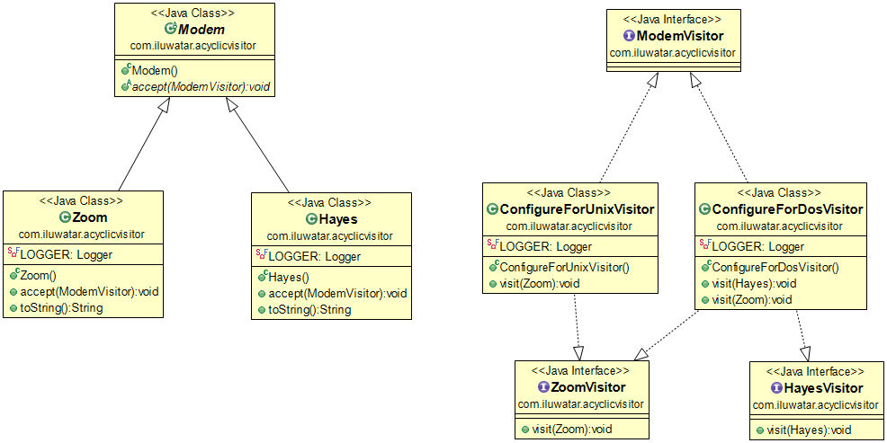

## 意图
允许新的方法添加到已存在的结构中，而不影响已存在的结构。并不会产生GOF中的访客模式造成的循环依赖问题。

## 适用性

这个设计模式可以被用来：
* 当你需要添加新方法并不想影响到原有的系统的时候
* 当存在方法可以操作当前层级，但不属于层级时
* 当你需要根据对象的类型进行不同的操作的时候
* 当被访问的层级经常产生新的派生类时

## 后果
好处：
* 消除了循环依赖
* 不需要重新编译
* 不会因为添加新的成员而编译失败

坏处：
* 违反了最少知道原则和里式替换原则
* 必须与被访问者同级

## 相关设计模式
* [Visitor Pattern](../visitor/README.md)

## Credits
* [Acyclic Visitor](http://condor.depaul.edu/dmumaugh/OOT/Design-Principles/acv.pdf)