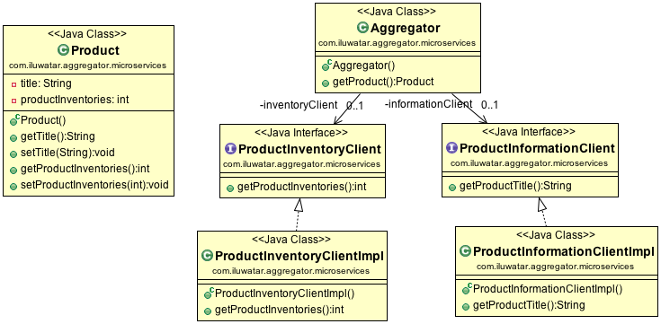

## 意图

用户对聚合器发起一次请求，然后聚合器对着每一个相关的微服务或者集合数据发起求情，调用相应的业务逻辑，比如远程的REST接口。大部分的聚合器是：
- 代理微服务设计模式：不同的服务被业务调用。
- 调用链微服务设计模式：在这个设计模式中，每个微服务需要依赖一连串的其他微服务。

## 适用性

当你需要一个统一的调用API时使用聚合微服务。

## 引用

* [Microservice Design Patterns](http://blog.arungupta.me/microservice-design-patterns/)