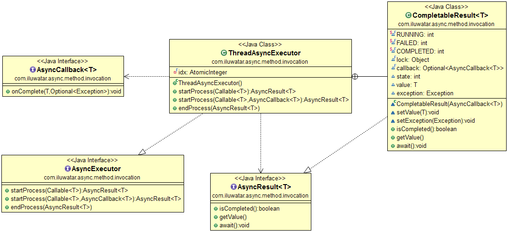

## 意图
异步方法调用是一个等待任务执行结果时不被阻塞的设计模式。这个设计模式提供了对多任务的平行处理以及通过检索和等待所有任务结束。

## 适用性
当出现如下情况时可以使用异步方法设计模式：

* 你有许多独立的任务可以平行执行
* 你需要提升一组任务执行的性能
* 你需要达到处理任务的极限速度或者需要执行一个长时间的任务而不需要等到任务执行完成

## 现实案例

* [FutureTask](http://docs.oracle.com/javase/8/docs/api/java/util/concurrent/FutureTask.html), [CompletableFuture](https://docs.oracle.com/javase/8/docs/api/java/util/concurrent/CompletableFuture.html) and [ExecutorService](http://docs.oracle.com/javase/8/docs/api/java/util/concurrent/ExecutorService.html) (Java)
* [Task-based Asynchronous Pattern](https://msdn.microsoft.com/en-us/library/hh873175.aspx) (.NET)

