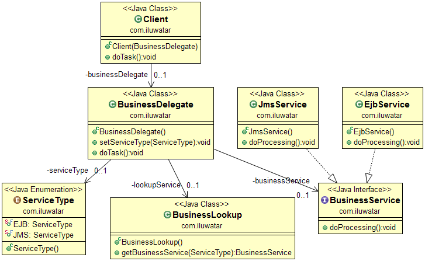

## 意图
业务代理模式在业务层与表现层之间增加了一层抽象。通过这个设计模式使我们在松耦合与封装之间实现如何定位连接交互。

## 适用性
以下场景可使用业务代理：

* 当你需要业务层与表现层解耦时
* 当你需要编排多个服务
* 当你需要封装对象查找和服务调用

## 引用

* [J2EE Design Patterns](http://www.amazon.com/J2EE-Design-Patterns-William-Crawford/dp/0596004273/ref=sr_1_2)
