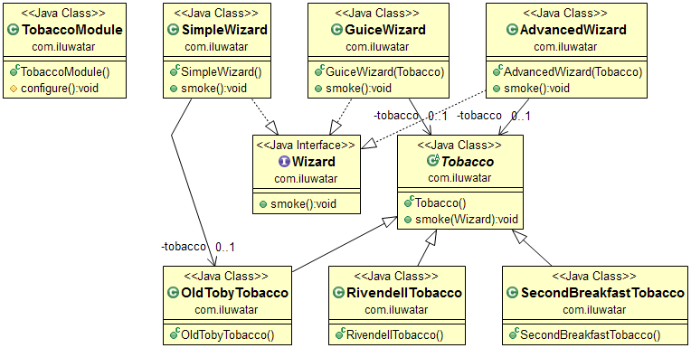

# 依赖注入
---
layout: pattern
title: Dependency Injection
folder: dependency-injection
permalink: /patterns/dependency-injection/
categories: Behavioral
tags:
 - Java
 - Difficulty-Beginner
---

## 意图

依赖注入是一个或多个依赖（服务）进行注入的软件设计模式。进入一个依赖对象（客户端），是由客户端的状态所组成的。这种设计模式分离了对象本身的表现以及它的依赖。这样就提供了松耦合，控制反转以及符合单一职责原则的设计。

## 适用性
当出现一下场景的时候，可以考虑使用依赖注入：

* 当你需要保持单一职责原则与最少知道原则来设计对象的时候
* 为了隔离测试单一模块的时候

