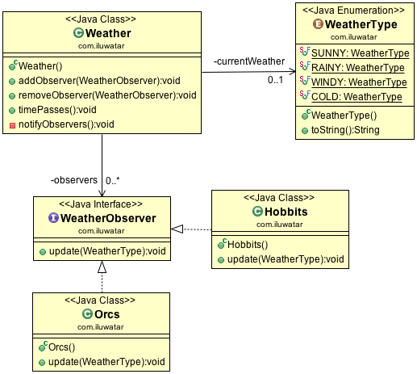

# 观察者
---
layout: pattern
title: Observer
folder: observer
permalink: /patterns/observer/
categories: Behavioral
tags:
 - Java
 - Difficulty-Beginner
 - Gang Of Four
 - Reactive
---

# 常被用做
依赖，发布订阅

# 意图
在对象之间定义一个一对多的依赖，当表示一的对象状态发生变化时，所有订阅的对象都会收到通知并发生改变。

## 适用性
在以下情况中可以使用观察者模式

* 当一个抽象有两个切面，一个依赖于另一个，这些切面分离的对象可以独立的重用。
* 当一个对象的改变需要通知其他对象，而且你不知道有多少个对象需要改变。
* 当你需要能够通知到其他对象而且不关心通知的对象是否存在。简单来说，你不希望紧密的耦合。

## 典型案例

* 当一个对象发生改变，引起其他对象的改变。

## 现实案例

* [java.util.Observer](http://docs.oracle.com/javase/8/docs/api/java/util/Observer.html)
* [java.util.EventListener](http://docs.oracle.com/javase/8/docs/api/java/util/EventListener.html)
* [javax.servlet.http.HttpSessionBindingListener](http://docs.oracle.com/javaee/7/api/javax/servlet/http/HttpSessionBindingListener.html)
* [RxJava](https://github.com/ReactiveX/RxJava)

## Credits

* [Design Patterns: Elements of Reusable Object-Oriented Software](http://www.amazon.com/Design-Patterns-Elements-Reusable-Object-Oriented/dp/0201633612)
* [Java Generics and Collections](http://www.amazon.com/Java-Generics-Collections-Maurice-Naftalin/dp/0596527756/)